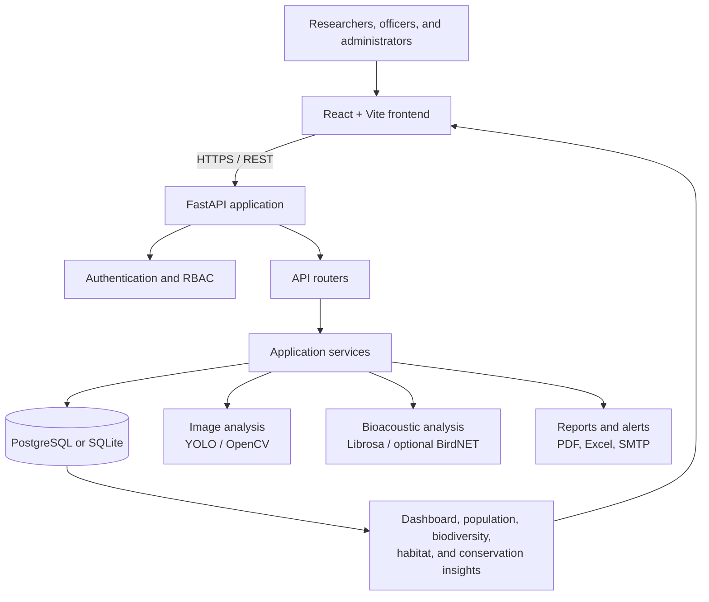

# Wildlife Population Intelligence System

An AI-assisted, full-stack platform that converts wildlife observations into useful conservation intelligence. The system helps researchers and conservation teams record surveys, identify species from images, analyse audio observations, monitor habitat conditions, study population trends, and produce reports from one workspace.

## 🌐 Live Deployments & Repository Links

- **Live Web Application (Frontend):** [https://wildlife-population-intelligence-sy-five.vercel.app](https://wildlife-population-intelligence-sy-five.vercel.app)
- **Live API Backend (Render):** [https://wildlife-population-intelligence-system-1.onrender.com](https://wildlife-population-intelligence-system-1.onrender.com)
- **Interactive Swagger API Docs:** [https://wildlife-population-intelligence-system-1.onrender.com/api/docs](https://wildlife-population-intelligence-system-1.onrender.com/api/docs)
- **Production Repository:** [https://github.com/piratesofthecaribbean/Wildlife-Population-Intelligence-System](https://github.com/piratesofthecaribbean/Wildlife-Population-Intelligence-System)
- **Group 2 Development Repository (Ayush-Verma Branch):** [https://github.com/springboardmentor27400b/Wildlife-Population-Intelligence-System-Group-2/tree/Ayush-Verma](https://github.com/springboardmentor27400b/Wildlife-Population-Intelligence-System-Group-2/tree/Ayush-Verma)

## Contents

- [Live Deployments & Repository Links](#-live-deployments--repository-links)
- [Project overview](#project-overview)
- [Workflow and architecture](#workflow-and-architecture)
- [Features](#features)
- [Implementation phases](#implementation-phases)
- [Tools and technology](#tools-and-technology)
- [Project structure](#project-structure)
- [Getting started](#getting-started)
- [API modules](#api-modules)
- [Configuration and model files](#configuration-and-model-files)
- [Testing](#testing)
- [License](#license)

## Project overview

Camera traps, field surveys, and audio sensors can produce more observations than a conservation team can review manually. This project provides a workflow for collecting those observations and turning them into searchable species records, analytics, alerts, and conservation recommendations.

The platform is designed for wildlife researchers, conservation officers, forest departments, and administrators. It includes JWT-based authentication and role-based access control (RBAC), a React dashboard, and a FastAPI backend that exposes documented REST endpoints.

## Workflow and architecture

### End-to-end workflow

1. A user signs in and records a survey, species, habitat, or monitoring-device context.
2. The user uploads a wildlife image or audio recording through the web application.
3. The FastAPI API validates the request, applies access rules, and sends it to the relevant service.
4. Image services can use a configured YOLO model to identify wildlife; bioacoustic services derive audio features and can use an optional BirdNET model when configured.
5. Detections and observations are stored with their metadata. Population, biodiversity, habitat, and conservation services aggregate that information.
6. The dashboard presents trends, metrics, maps, alerts, and exportable reports so teams can act on the findings.

### Application architecture



### How the code is organised

- `frontend/` provides the browser interface, protected routes, dashboard pages, charts, maps, and upload workflows.
- `backend/app/routers/` receives API requests and separates endpoints by feature area.
- `backend/app/services/` contains the business logic for image analysis, bioacoustics, population intelligence, biodiversity metrics, habitat intelligence, conservation recommendations, alerts, and reports.
- `backend/app/models/` and `backend/app/schemas/` define the database records and request/response validation contracts.
- SQLAlchemy connects the application to PostgreSQL in Docker or SQLite for a simple local setup.

## Features

### Secure access and administration

- User registration, login, bearer-token authentication, and current-user profile endpoint.
- Role-based permissions for application actions and administrative user management.
- Monitoring-device administration and system-health diagnostics.

### Field monitoring and species records

- Create, update, list, and remove surveys.
- Maintain a species catalog and identify recognised model labels.
- Record habitat information and manage monitoring-device metadata.
- Upload and browse image detection records.

### AI-assisted observation analysis

- YOLO/Ultralytics image-analysis integration with configurable model path and confidence threshold.
- Audio-analysis endpoints for recording history and analysis.
- Optional BirdNET model configuration for bioacoustic workflows.
- Trained weights, datasets, and run outputs stay outside Git to keep the repository lightweight and safe to share.

### Ecological intelligence and intervention support

- Population estimates, trends, migration views, and species-distribution endpoints.
- Biodiversity metrics, observation summaries, predictions, trends, endangered-species views, and report exports.
- Habitat health information, ecosystem health score, conservation recommendations, and alerts.
- Dashboard statistics and role-specific views for fast situational awareness.

### Reports and visualisation

- PDF and Excel export capability through the reporting services.
- Interactive frontend charts using Recharts and map views using Leaflet.
- A Docker-based deployment path with PostgreSQL, FastAPI, React, and Nginx.

## Implementation phases

The project roadmap is divided into four phases. The phases explain how the platform is built incrementally, from a secure foundation to an integrated intelligence system.

| Phase | Focus | Main implementation work | Outcome |
| --- | --- | --- | --- |
| 1. Foundation and monitoring | Set up the core platform | Project structure, database models, authentication, RBAC, surveys, species, habitats, and monitoring devices | Secure users can manage the core field-monitoring data |
| 2. Species recognition and biodiversity | Turn raw observations into species information | Image-detection workflow, audio-analysis workflow, species identification, biodiversity services, and export support | Teams can upload evidence and explore biodiversity information |
| 3. Population and conservation intelligence | Translate observations into management insight | Population estimates and trends, habitat intelligence, ecosystem health scoring, recommendations, alerts, and dashboards | Teams can prioritise conservation activity with data-backed indicators |
| 4. Integration and delivery | Make the system reliable and deployable | Frontend-backend integration, API validation, automated tests, Docker Compose, Nginx, documentation, and presentation assets | A demonstrable full-stack wildlife intelligence application |

## Tools and technology

| Area | Tools used in this project | Purpose |
| --- | --- | --- |
| Frontend | React 18, Vite, Tailwind CSS | Responsive single-page application and UI styling |
| Visualisation | Recharts, Leaflet, React-Leaflet | Charts, analytics views, and interactive maps |
| Backend | Python, FastAPI, Uvicorn, Pydantic | REST API, validation, and server runtime |
| Data layer | SQLAlchemy, Alembic, PostgreSQL, SQLite | Database access, migrations, containerised database, and local fallback |
| Security | python-jose, Passlib, bcrypt | JWT tokens and password hashing |
| Computer vision | Ultralytics YOLO, PyTorch, Torchvision, OpenCV, Pillow | Wildlife image inference and model training support |
| Bioacoustics | Librosa, SoundFile | Audio feature extraction and recording analysis |
| Analytics and reports | NumPy, Pandas, scikit-learn, ReportLab, OpenPyXL | Data processing, metrics, PDF reports, and Excel exports |
| DevOps | Docker, Docker Compose, Nginx | Repeatable local deployment and frontend serving |

## Project structure

```text
WildlifePopulationSystem/
├── backend/
│   ├── app/
│   │   ├── models/             # SQLAlchemy data models
│   │   ├── routers/            # FastAPI endpoint modules
│   │   ├── schemas/            # Pydantic validation schemas
│   │   └── services/           # AI, analytics, alerts, and reporting logic
│   ├── tests/                  # Backend automated tests
│   ├── .env.example            # Backend configuration template
│   ├── Dockerfile
│   └── requirements.txt
├── frontend/
│   ├── src/
│   │   ├── components/         # Reusable interface components
│   │   ├── context/            # Authentication and theme state
│   │   ├── pages/              # Feature and dashboard screens
│   │   └── services/           # API client
│   ├── .env.example
│   ├── Dockerfile
│   └── package.json
├── dataset/                    # Dataset layout and usage notes
├── model/                      # Local model-weight location; weights are ignored
├── scripts/                    # Model training and utility scripts
├── Project_Presentation/       # Exported presentation slides
└── docker-compose.yml          # PostgreSQL, backend, and frontend services
```

## Getting started

### Prerequisites

- Python 3.11 or later
- Node.js 20 or later and npm
- Docker Desktop (recommended for the complete local stack)

### Option A: run with Docker Compose

1. Create your backend configuration:

   ```bash
   cp backend/.env.example backend/.env
   ```

2. Set a strong `JWT_SECRET_KEY` in `backend/.env`. Review the database and model settings before deploying outside your computer.

3. Build and start the services:

   ```bash
   docker compose up --build
   ```

4. Open the frontend at [http://localhost:3000](http://localhost:3000). Interactive API documentation is available at [http://localhost:8000/api/docs](http://localhost:8000/api/docs).

### Option B: run locally without Docker

#### Backend

```bash
python -m venv .venv
source .venv/bin/activate
pip install -r backend/requirements.txt

cp backend/.env.example backend/.env
# Update backend/.env with a strong JWT_SECRET_KEY and your database URL.

cd backend
uvicorn app.main:app --reload --host 0.0.0.0 --port 8000
```

For a minimal local setup, the application defaults to SQLite when `DATABASE_URL` is not set. For the Compose configuration, use PostgreSQL as specified in `backend/.env.example`.

#### Frontend

In a second terminal:

```bash
cd frontend
npm install
cp .env.example .env
npm run dev
```

Open the URL printed by Vite (usually [http://localhost:5173](http://localhost:5173)). Set `VITE_API_BASE_URL` in `frontend/.env` to `http://localhost:8000/api/v1` for local development.

## API modules

All application endpoints use the `/api/v1` prefix. Browse the live OpenAPI documentation at `/api/docs` after starting the backend.

| Module | Example endpoints | Responsibility |
| --- | --- | --- |
| Authentication | `POST /auth/register`, `POST /auth/login`, `GET /auth/me` | Accounts, JWTs, and user identity |
| Surveys | `GET/POST /surveys`, `PUT/DELETE /surveys/{survey_id}` | Field survey management |
| Species | `GET/POST /species`, `GET /species/catalog` | Species records and identification lookup |
| Detections | `GET /detections`, `POST /detections/upload` | Image upload and detection records |
| Audio | `GET /audio/history`, `POST /audio/analyze` | Audio-observation analysis |
| Biodiversity | `GET /biodiversity/metrics`, `/trends`, `/reports/pdf` | Ecological metrics and report exports |
| Population | `GET /population/estimates`, `/trends`, `/migration` | Population and distribution intelligence |
| Conservation | `GET /conservation/health-score`, `/recommendations`, `/alerts` | Health scoring, priorities, and alerts |
| Dashboard and admin | `GET /dashboard/stats`, `GET /admin/system-health` | Dashboard data and administration |

## Configuration and model files

Copy the supplied templates rather than creating configuration from scratch:

```bash
cp backend/.env.example backend/.env
cp frontend/.env.example frontend/.env
```

Important backend settings include `DATABASE_URL`, `JWT_SECRET_KEY`, `YOLO_MODEL_PATH`, `YOLO_CONFIDENCE_THRESHOLD`, `BIRDNET_MODEL_PATH`, and SMTP settings for alert delivery. The frontend uses `VITE_API_BASE_URL` to reach the API.

Do not commit real `.env` files, database files, uploads, datasets, virtual environments, model weights, or training-run output. These files are ignored intentionally.

To use a trained image model, place the weights at the path set by `YOLO_MODEL_PATH` (the template uses `model/best.pt`). The included training script fine-tunes a YOLO11 nano model on the Ultralytics African Wildlife dataset and copies the resulting `best.pt` into `model/`:

```bash
python scripts/train_wildlife_model.py
```

See [dataset/README.md](dataset/README.md) and [model/README.md](model/README.md) for the expected data and model layout.

## Testing

Run backend tests:

```bash
cd backend
pytest
```

Build the frontend for production:

```bash
cd frontend
npm run build
```

## Contributing

Create a focused branch, make one coherent change, run the relevant checks, and describe the user-facing impact in the pull request. Never commit credentials, private field data, or large generated model and dataset artifacts.

## License

Released under the [MIT License](LICENSE).
